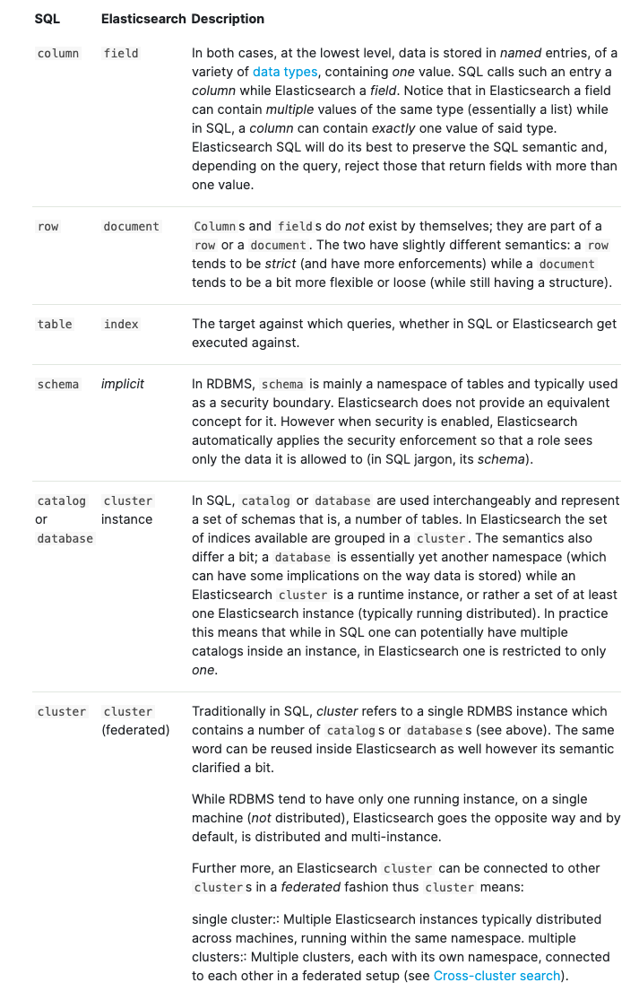
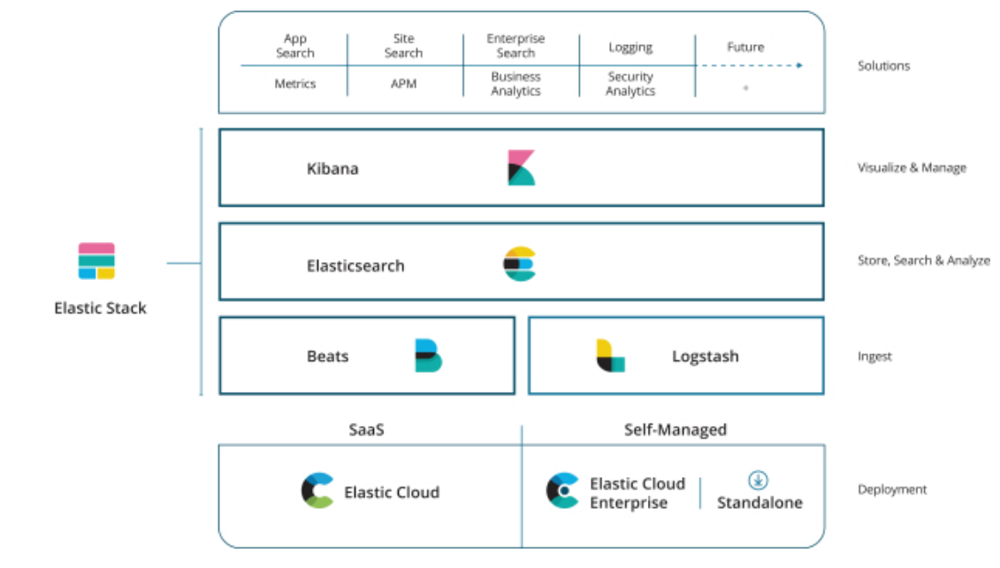
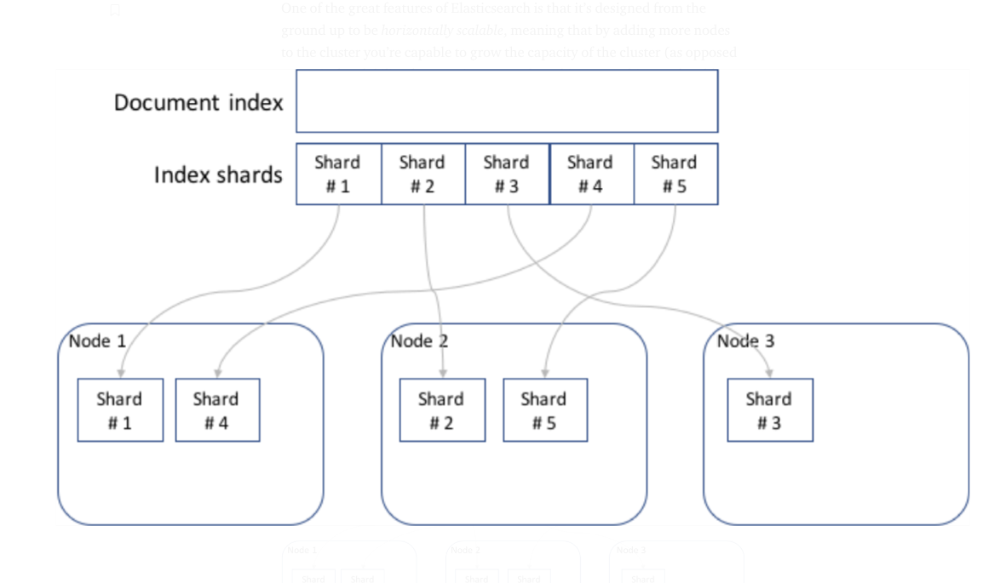
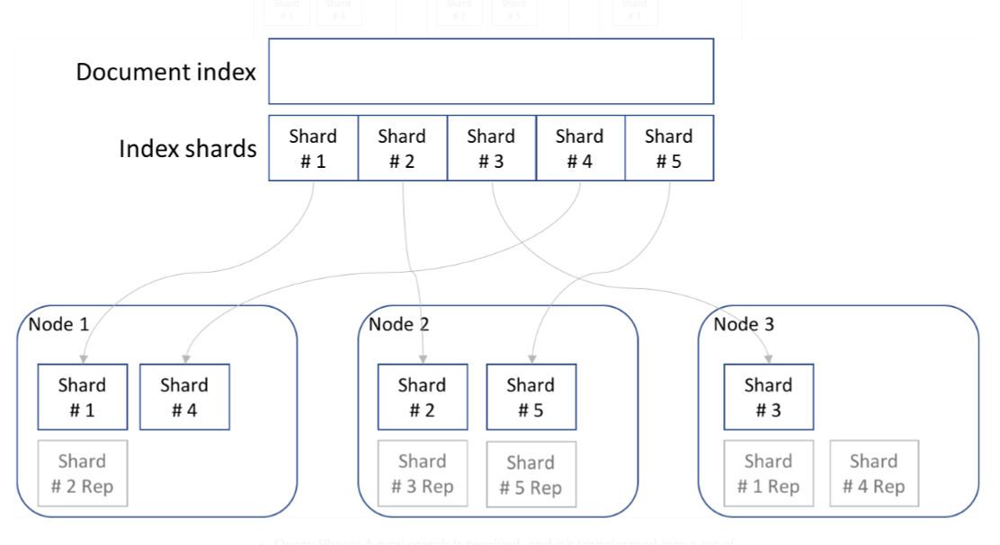
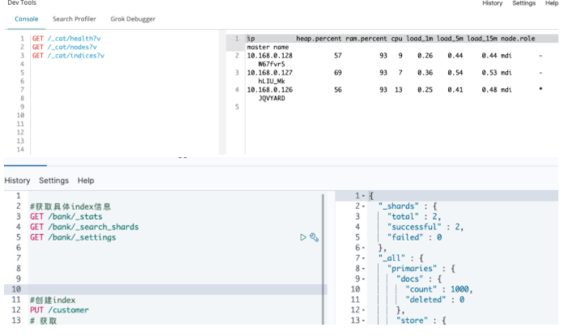
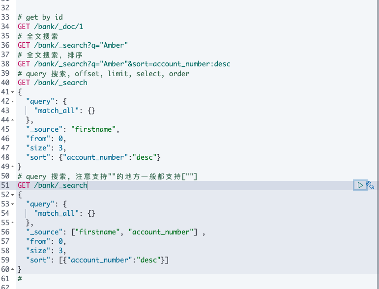
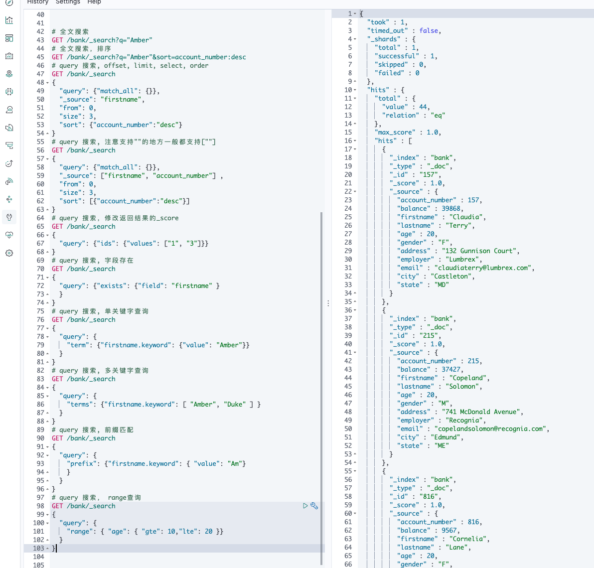

[toc]

### doc

* phabri: https://phabri.meetwhale.com/w/product/be/%E6%8A%80%E6%9C%AF%E5%88%86%E4%BA%AB/elasticsearch_quick_start/
* elastic stack: https://www.elastic.co/guide/en/elastic-stack-get-started/7.2/get-started-elastic-stack.html
* reference: https://www.elastic.co/guide/en/elasticsearch/reference/master/index.html
* query DSL: https://www.elastic.co/guide/en/elasticsearch/reference/current/query-dsl.html
* rest apis: https://www.elastic.co/guide/en/elasticsearch/reference/master/rest-apis.html
* test-analyzer : www.elastic.co/guide/en/elasticsearch/reference/current/test-analyzer.html
* painless:  https://www.elastic.co/guide/en/elasticsearch/painless/current/painless-api-reference.html


### why used?

* 为减少数据库查询压力
* 为强大的分词搜索能力, 经纬度搜索, 全文搜索
* 为自定义不同的查询权重
* 为强大的logs analyze , debug
* 为强大的aggregations, 方便metrics
* 为强大的报表生成， kibana dashboard, Visualizations,同grafana

### elasticsearch vs SQL

* `https://www.elastic.co/guide/en/elasticsearch/reference/current/_mapping_concepts_across_sql_and_elasticsearch.html`



### 遇到的问题

* 版本问题, 不同版本接口不一样，生成的mapping也不一样，即dev, production版本大版本一定要一样
* mapping问题, 不同mapping对应不同查询的, 自动mapping将影响原本代码的查询
* index问题, 升级等都对index有影响， 非green则不可用，即search将不可用
* query string query, full text查询的一种， 注意需要转义特殊字符，否则报错
* 查询问题， string对应的keyword类型, 不分词, 即完整匹配，用full text queries也没用，即用了keyword type就相当于放弃分词查询
* 查询问题， 注意不要用term查询text字段， 如要查询name: 'betty zhao', 无法查到，实际查询时term完整匹配betty 或者完整匹配zhao, 不会完整匹配‘betty zhao’


### what is Elastic Stack

* https://www.elastic.co/guide/en/elastic-stack-get-started/7.2/get-started-elastic-stack.html



### introduction

* elasticsearch, 分布式
    * the distrubuted search and analytics engine, 分布式搜索引擎
    * the distributed document store， 分布式存储
    * built on the Apache Lucene search engine library， 基于apache lucene
    * multi shards, 读写负载均衡, 提高读写速度
    * multi replicas, 数据冗余， 目前我们不冗余， 因为丢了就全量同步一次 
* elasticsearch, 查询相关
    * real-time fast search
    * fully searchable， full-text searches
    * indexes all data in every field 
    * all types of data , custom and dynamic mapping 
    * json documnet
    * REST API or Elasticsearch Client managing your cluster
    * REST API or Elasticsearch Client searching your data
* elasticsearch, 读写数据, 
    * elastic api, http api CURD数据
    * elastic client, 本质也是http api CURD数据
* elasticsearch, 采集数据,Logstash and Beats, collecting, aggregating data and storing in elasticsearch
* kibana，展示数据， 视图化展示


#### clusters, nodes, and shards and index

* https://medium.com/hipages-engineering/scaling-elasticsearch-b63fa400ee9e
* clusters, nodes即服务的节点数, 同kafka broker
* shards, 写读负载均衡，加快数据写， 加快查询, 同kafka partition
* replicas, 即primaries and replicas, 数据冗余， 一般0即只有primaries, 同kafka replication
* index, 需要配置shards and replicas, 同sql  table, 也同kafka topic

* * *
* Sharding of the document index and assignment to nodes: 5 shards ， 0 replicas



* * *
*  Shards and replicas — 5 shards, 1 replica


* * *
* Docs per node for different settings of # of shards and replicas


### Getting started with Elasticsearch

*  https://www.elastic.co/cloud/elasticsearch-service/signup


#### install

```
  ~ cd Downloads/elasticsearch-6.5.4
➜  elasticsearch-6.5.4 ./bin/elasticsearch -d

➜  ~ cd Downloads/kibana-6.5.4-darwin-x86_64
➜  kibana-6.5.4-darwin-x86_64 ./bin/kibana &

➜  ~ cd Downloads/apm-server-6.5.2-darwin-x86_64
➜  apm-server-6.5.2-darwin-x86_64 ./apm-server&

```

#### exploring your cluster(monitor, status, index, health)

*  具体参考 rest apis > cat apis
* cluster health, `GET /_cat/health?v`
* list all nodes, `GET /_cat/nodes?v`
* list all indices, `GET /_cat/indices?v`



#### manage index

* create an index, `PUT /customer?pretty`
* delete an index, `DELETE /customer`
* get index mapping `GET /whale-shop/_mapping`
* get index settings,`GET /bank/_settings`
* get index shards,`GET /bank/_search_shards`
* get index status,`GET /bank/_stats`

#### monifying your data(cud)

* create, put,
* bulk create, put 
* update, put or post
* delete, delete
 
### Mapping

* Field datatypes
    * string 
        * text, 会分词，Term-level queries, full text queries
        * keyword, 不分词, 即完整匹配，用full text queries也没用，即用了keyword type就相当于放弃分词查询
    * numeric 
    * data
    * boolean
    * range
    * array(java ArrayList)
    * object
    * nested
* dynamic mapping
    * true / false > boolean
    * floating > float
    * integer > long
    * object > object
    * string > text with sub-field keyword

#### custom mappings优点

* Distinguish between full-text string fields and exact value string fields
* Perform language-specific text analysis
* Optimize fields for partial matching
* Use custom date formats
* Use data types such as geo_point and geo_shape that cannot be automatically detected
* index the same field in different ways for different purposes
* 注意， 没有创建mapping情况有index数据，系统就自动mapping, 此时存在查询不兼容问题

#### start searching

* 全文搜索，
* 字段存在，
* 单关键字查询，
* 多关键字查询， 
* 前缀匹配，
* range查询
* must即and, should即or, must_not即not, filter同must即and
* id查， ids查询，exists查询，
* offset, limit, select, order




### REST APIs (定义http request url)

* cat apis， 查询info, status系统级api
* document apis, 针对具体document的api, 可单document, 多document
* index apis, 管理index, 代码里面， kibana都有操作
* search apis,查询api, body json格式详细查询`Query DSL`
* 其他...


### Query DSL (定义http request body)

* https://www.elastic.co/guide/en/elasticsearch/reference/current/query-dsl.html
* 遵循Query DSL(domain special language), baze on JSON
* leaf query, 单字段查询, 对指定field查询指定value， 包full-text, term, top-level match_all, match_none查询 
* compound query, 组合查询, 即组合leaf query
* 具体数据类型具体字段查询查询，
    * term-level queries,  按照具体的field类型做具体查询，查询字段类型匹配且value完整匹配
    * full-text queries, text类型的模糊查询，分词查询，当然也可其他类型，只是没必要
    * compound queries, 多种，目前我们就用bool query
    * joining queries, nested field数据，如tag.name

#### compoud queries

*  bool (compound query)
    * must: 1 or []， `and`, 必须满足多个，
    * filter:1 or [] , `and`, 同must, 不会评估匹配度
    * should: 1 or [], `or`, 满足一个就可以，会评估匹配度，
    * must_not: 1 or [], `not` ,反查

#### Full text queries

* full text, 针对具体方法支持具体data type
* match， 如果是text字段分词匹配， 非text一般都精准匹配
* multi_match, 多fields查询， 一个匹配到就行
* query string， 支持and or not, discover, grafana里面也是用这个语法
 
#### Joining queries

* nested query
* has_child
* has_parent

#### Term-level queries(常用)

* exists, field是否存在
* fuzzy, term类型的模糊查询
* ids，ids查询
* prefix，前缀
* range，numeric， data, ip
* regexp，正则
* term，contain an exact term in a provided field
    * 注意不要用term查询text字段， 如要查询name: 'betty zhao', 无法查到，实际查询时term完整匹配betty 或者完整匹配zhao, 不会完整匹配‘betty zhao’
* terms，多value查询， contain one or more exact terms in a provided field
* terms set，具体查文档
* type query，具体查文档
* wildcard,具体查文档

### text analysis

* 见 `elastic > elasticsearch,  text analyzers`
* 模糊查询对应的分词方式
* standard analyzer, https://www.elastic.co/guide/en/elasticsearch/reference/6.5/analysis-standard-analyzer.html
* 分析tool, www.elastic.co/guide/en/elasticsearch/reference/current/test-analyzer.html


### Aggregations

* https://www.elastic.co/guide/en/elasticsearch/reference/current/search-aggregations.html
* 数据库的聚合都有
* 不同类型的数据聚合方法不同

### SQL access

* 即数据库的查询方式


### Scripting

* painle:  https://www.elastic.co/guide/en/elasticsearch/painless/current/painless-api-reference.html
* update 时常用到

#### Single document APIs,Update API 

* update with partial document
* scripted updates, update feild
* scripted updates,add/remove item to  array
* scripted updates,do noting when exists
```
POST test/_doc/1/_update
{
    "doc" : {
        "name" : "new_name"
    }
}
```
```
POST test/_doc/1/_update
{
    "script" : {
        "source": "ctx._source.counter += params.count",
        "lang": "painless",
        "params" : {
            "count" : 4
        }
    }
}
```
```
POST test/_doc/1/_update
{
    "script" : {
        "source": "ctx._source.tags.add(params.tag)",
        "lang": "painless",
        "params" : {
            "tag" : "blue"
        }
    }
}
```
```
POST test/_doc/1/_update
{
    "script" : {
        "source": "if (ctx._source.tags.contains(params.tag)) { ctx._source.tags.remove(ctx._source.tags.indexOf(params.tag)) }",
        "lang": "painless",
        "params" : {
            "tag" : "blue"
        }
    }
}
```
```
POST test/_doc/1/_update
{
    "script" : {
        "source": "if (ctx._source.tags.contains(params.tag)) { ctx.op = 'delete' } else { ctx.op = 'none' }",
        "lang": "painless",
        "params" : {
            "tag" : "green"
        }
    }
}
```
#### Single document APIs,Update By Query API 

```
POST twitter/_update_by_query
{
  "script": {
    "source": "ctx._source.likes++",
    "lang": "painless"
  },
  "query": {
    "term": {
      "user": "kimchy"
    }
  }
}
```